# Тема 1. Введение. Основы теории баз данных

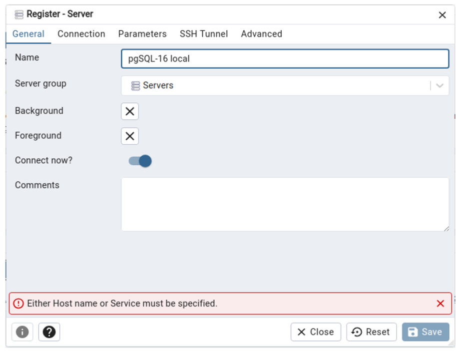


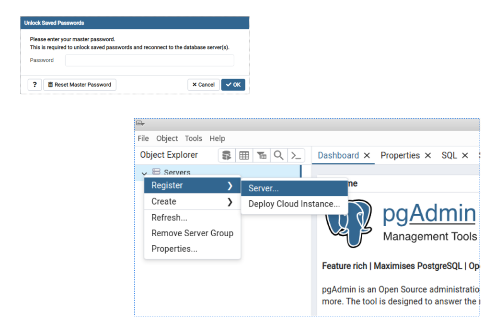

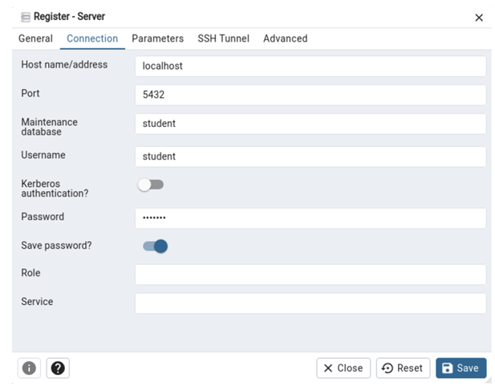

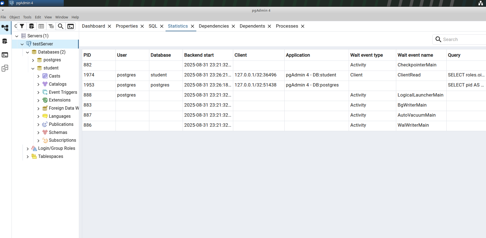

## Архитектура PostgreSQL

### Основные компоненты:
1. **Postmaster** - главный процесс сервера
2. **Backend процессы** - обслуживают клиентские подключения
3. **Вспомогательные процессы** - фоновые задачи
4. **Разделяемая память** - буферы, кэши

### Процессы PostgreSQL:

#### Postmaster
- Запускается при старте сервера
- Принимает подключения клиентов
- Создает backend процессы
- Управляет вспомогательными процессами

#### Backend процессы
- По одному на каждое клиентское подключение
- Выполняют SQL запросы
- Работают с данными в памяти и на диске

#### Вспомогательные процессы:
- **WAL writer** - записывает журнал транзакций
- **Checkpointer** - сохраняет данные на диск
- **Autovacuum** - очищает устаревшие данные
- **Stats collector** - собирает статистику

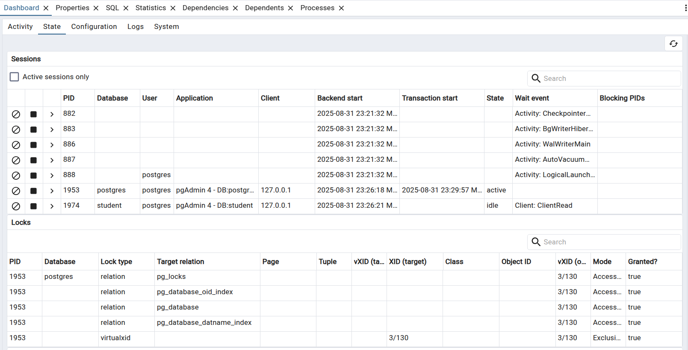

### Основные каталоги:
```
$PGDATA/
├── base/           # Файлы баз данных
├── global/         # Глобальные таблицы
├── pg_wal/         # Журнал транзакций (WAL)
├── pg_log/         # Логи сервера
├── postgresql.conf # Основной конфиг
└── pg_hba.conf     # Настройки аутентификации
```

### Файлы данных:
- Каждая таблица - отдельный файл
- Размер файла ограничен 1GB
- При превышении создаются дополнительные файлы

## Конфигурационные файлы

### postgresql.conf
Основные параметры:
```
# Подключения
listen_addresses = 'localhost'
port = 5432
max_connections = 100

# Память
shared_buffers = 128MB
work_mem = 4MB
maintenance_work_mem = 64MB

# Журналирование
wal_level = replica
max_wal_size = 1GB
```

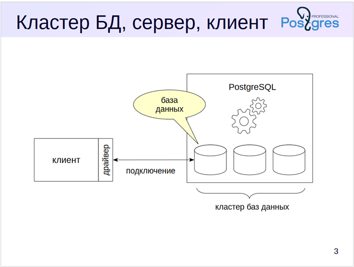

## Практическое задание

1. Найдите расположение файлов PostgreSQL:
```sql
SHOW data_directory;
SHOW config_file;
SHOW hba_file;
```

2. Посмотрите активные процессы:
```sql
SELECT pid, usename, application_name, state 
FROM pg_stat_activity;
```

3. Проверьте настройки памяти:
```sql
SHOW shared_buffers;
SHOW work_mem;
SHOW maintenance_work_mem;
```

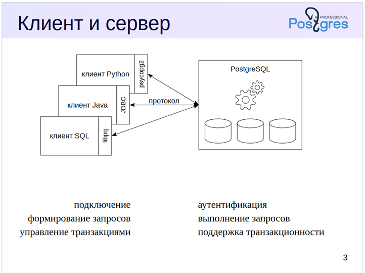


### Основные понятия PostgreSQL

**PostgreSQL** — это программа, которая относится к классу **Систем Управления Базами Данных (СУБД)**.

#### Ключевые компоненты:

*   **Сервер (Экземпляр сервера)**
    *   Когда программа PostgreSQL запущена и выполняется, она называется **сервером PostgreSQL** или **экземпляром сервера**.
    *   Это основной процесс, который управляет всеми операциями с данными.

*   **Кластер баз данных**
    *   Данные, которыми управляет PostgreSQL, хранятся в **базах данных**.
    *   Один экземпляр (сервер) PostgreSQL одновременно работает с множеством баз данных.
    *   Совокупность всех баз данных, которыми управляет один экземпляр сервера, называется **кластером баз данных**.

*   **Клиент**
    *   С сервером взаимодействуют **клиенты** — внешние приложения (например, `psql`, графические IDE или веб-приложения).
    *   Клиент подключается к конкретной базе данных в кластере с помощью **драйвера** (библиотеки, реализующей протокол подключения) и посылает серверу запросы для выполнения.

---

#### Итог:

*   **Кластер баз данных** — это данные, хранящиеся в файлах на диске.
*   **Сервер (экземпляр)** — это работающая программа, которая управляет кластером баз данных.
*   **Клиент** — это программа, которая подключается к серверу и позволяет "общаться" с ним.


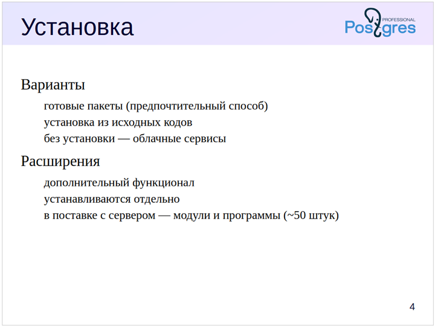


### Варианты установки и развёртывания PostgreSQL

#### 1. Пакетные менеджеры (Рекомендуемый вариант)
*   Использование менеджеров пакетов (`apt`, `yum`, `rpm` и т.д.) и готовых пакетов.
*   **Преимущества:**
    *   Понятная конфигурация.
    *   Поддерживаемая и легко обновляемая установка.
    *   Пакеты доступны для большинства популярных операционных систем.

#### 2. Сборка из исходных кодов
*   Может потребоваться для:
    *   Установки нестандартных значений параметров.
    *   Использования на непопулярных или специфических платформах.
*   **Источники:**
    *   Готовые пакеты и исходные коды можно скачать на официальном сайте: [http://www.postgresql.org/download/](http://www.postgresql.org/download/)

#### 3. Облачные решения (DBaaS - Database as a Service)
*   Позволяют обойтись без самостоятельной установки и администрирования сервера.
*   **Примеры платформ:**
    *   **Зарубежные:** Amazon RDS, Google Cloud SQL, Microsoft Azure Database
    *   **Отечественные:** Yandex Cloud, Облако Mail.ru

---

### Конфигурация в рамках курса

*   **ОС:** Xubuntu 22
*   **Версия СУБД:** PostgreSQL 16
*   **Способ установки:** Из официальных пакетов для ОС.
*   **Преимущество данного способа:** Автоматическая настройка запуска и остановки сервера PostgreSQL вместе с операционной системой.

---

### Расширения PostgreSQL

PostgreSQL поддерживает мощный механизм **расширений**, которые подключают новый функционал к СУБД «на лету», без изменения ядра системы.

*   В стандартный дистрибутив входит около 50 расширений.
*   Документация по расширениям:
    *   [https://postgrespro.ru/docs/postgresql/16/contrib](https://postgrespro.ru/docs/postgresql/16/contrib)
    *   [https://postgrespro.ru/docs/postgresql/16/contrib-prog](https://postgrespro.ru/docs/postgresql/16/contrib-prog)
*   Для просмотра списка всех доступных расширений и статуса их установки можно использовать представление `pg_available_extensions`.

**Пример запроса:**
```sql
SELECT * FROM pg_available_extensions;
```

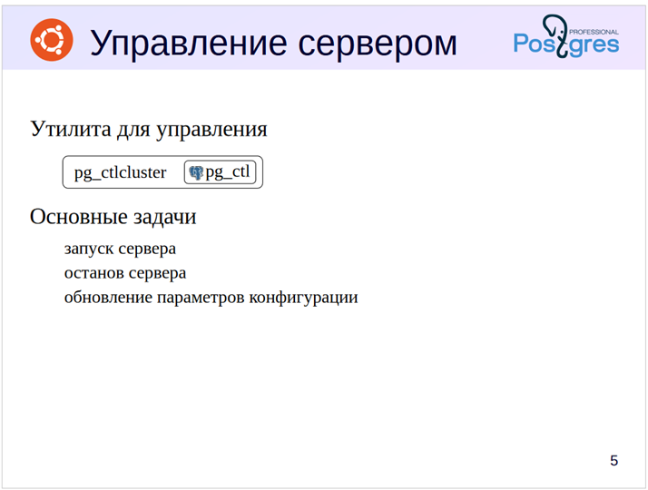

### Управление сервером PostgreSQL

К основным операциям управления сервером относятся:
*   Начальная инициализация (создание) кластера баз данных.
*   Запуск и останов сервера.
*   Обновление конфигурации.
*   Перезагрузка конфигурации.
*   Просмотр статуса.

#### Утилита `pg_ctl`
*   Основная утилита для выполнения этих действий — `pg_ctl`, входящая в состав PostgreSQL.
*   Документация: [https://postgrespro.ru/docs/postgresql/16/app-pg-ctl](https://postgrespro.ru/docs/postgresql/16/app-pg-ctl)

#### Особенность в дистрибутивах на базе Debian/Ubuntu
*   В пакетных дистрибутивах (таких как Ubuntu) прямой доступ к `pg_ctl` часто заменяется на специальную обёртку — **`pg_ctlcluster`**.
*   Эта утилита упрощает управление несколькими кластерами разных версий на одном сервере.

#### Основные команды

1.  **Просмотр справки:**
    ```bash
    man pg_ctlcluster
    ```

2.  **Получение информации об установленных кластерах и их статусе:**
    ```bash
    pg_lsclusters
    ```
    Или эквивалентная команда:
    ```bash
    pg_ctlcluster status
    ```

    Пример вывода:
    ```bash
    Ver Cluster Port Status Owner    Data directory              Log file
    16  main    5432 online postgres /var/lib/postgresql/16/main /var/log/postgresql/postgresql-16-main.log
    ```

3.  **Запуск кластера:**
    ```bash
    sudo pg_ctlcluster 16 main start
    ```

4.  **Остановка кластера:**
    ```bash
    sudo pg_ctlcluster 16 main stop
    ```

5.  **Перезагрузка конфигурации (без остановки сервера):**
    ```bash
    sudo pg_ctlcluster 16 main reload
    ```

6.  **Перезапуск кластера:**
    ```bash
    sudo pg_ctlcluster 16 main restart
    ```

---

#### Дополнительные материалы
*   Подробная информация об управлении сервером для администраторов баз данных в официальной документации: [Глава 18. Управление сервером](https://postgrespro.ru/docs/postgresql/16/runtime)

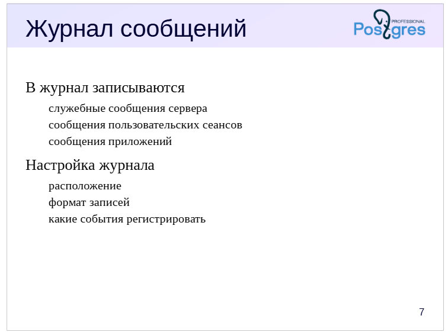

Конечно, вот структурированная информация о журнале сообщений сервера PostgreSQL в формате Markdown.

---

### Журнал сообщений сервера PostgreSQL

Журнал (лог) сервера — это основной источник информации о работе СУБД, содержащий записи о всех значимых событиях.

#### Назначение и содержание журнала

В журнал записывается:

*   **Служебная информация:** сведения о запуске и остановке сервера.
*   **Сообщения об ошибках:** информация о возникающих проблемах и сбоях.
*   **Диагностическая информация:**
    *   Сообщения о выполняющихся командах и времени их выполнения.
    *   Информация о возникающих блокировках (locks).
    *   Данные для трассировки пользовательских сеансов.
*   **Пользовательские сообщения:** разработчики приложений могут записывать в журнал свои собственные сообщения с помощью функции `RAISE LOG` (или аналогичной) в PL/pgSQL.

#### Гибкая настройка логирования

PostgreSQL предоставляет широкие возможности для настройки логирования через параметры в файле `postgresql.conf`:

*   **Уровень детализации:** определение минимального уровня severity для записи сообщений (DEBUG, INFO, NOTICE, WARNING, ERROR и т.д.).
*   **Формат вывода:** сообщения можно записывать в различных форматах:
    *   `stderr` (стандартный текстовый формат)
    *   `csvlog` — удобен для импорта в электронные таблицы и анализа утилитами.
    *   `jsonlog` — удобен для парсинга современными системами мониторинга и анализа (например, ELK Stack).
*   **Фильтрация:** настройка логирования для определенных баз, пользователей, типов операций (например, только медленные запросы).

#### Расположение и просмотр журнала

В стандартной установке на Ubuntu/Debian через пакеты журнал находится по пути:
`/var/log/postgresql/`

*   **Просмотр списка журналов:**
    ```bash
    ls -l /var/log/postgresql/
    ```

*   **Пример журнала для кластера `main` версии 16:**
    ```bash
    -rw-r----- 1 postgres adm 6234 фев  5 10:27 /var/log/postgresql/postgresql-16-main.log
    ```

#### Команды для просмотра журнала

*   **Просмотр последних 10 записей (заголовок файла):**
    ```bash
    tail -n 10 /var/log/postgresql/postgresql-16-main.log
    ```

*   **Просмотр журнала в реальном времени (очень полезно для отладки):**
    ```bash
    tail -f /var/log/postgresql/postgresql-16-main.log
    ```

*   **Поиск ошибок в журнале:**
    ```bash
    grep -i error /var/log/postgresql/postgresql-16-main.log
    ```

#### Пример записей из журнала

```log
2025-02-05 10:27:25.138 MSK [1600] LOG:  background worker "logical replication launcher" (PID 1606) exited with exit code 1
2025-02-05 10:27:25.138 MSK [1601] LOG:  shutting down
2025-02-05 10:27:25.148 MSK [1601] LOG:  checkpoint starting: shutdown immediate
2025-02-05 10:27:25.187 MSK [1601] LOG:  checkpoint complete: wrote 0 buffers (0.0%); 0 WAL file(s) added, 0 removed, 0 recycled; write=0.001 s, sync=0.001 s, total=0.050 s; sync files=0, longest=0.000 s, average=0.000 s; distance=0 kB, estimate=165807 kB; lsn=0/D5F2B68, redo lsn=0/D5F2B68
2025-02-05 10:27:25.205 MSK [1600] LOG:  database system is shut down
2025-02-05 10:27:25.601 MSK [11340] LOG:  starting PostgreSQL 16.3 (Ubuntu 16.3-1.pgdg22.04+1) on x86_64-pc-linux-gnu, compiled by gcc (Ubuntu 11.4.0-1ubuntu1~22.04) 11.4.0, 64-bit
2025-02-05 10:27:25.601 MSK [11340] LOG:  listening on IPv4 address "127.0.0.1", port 5432
2025-02-05 10:27:25.611 MSK [11340] LOG:  listening on Unix socket "/var/run/postgresql/.s.PGSQL.5432"
2025-02-05 10:27:25.637 MSK [11343] LOG:  database system was shut down at 2024-07-03 15:57:35 MSK
2025-02-05 10:27:25.664 MSK [11340] LOG:  database system is ready to accept connections
```

**Структура записи:**
1.  **Таймстамп:** `2025-02-05 10:27:25.664 MSK`
2.  **Идентификатор процесса:** `[11340]`
3.  **Уровень сообщения:** `LOG:`
4.  **Текст сообщения:** `database system is ready to accept connections`


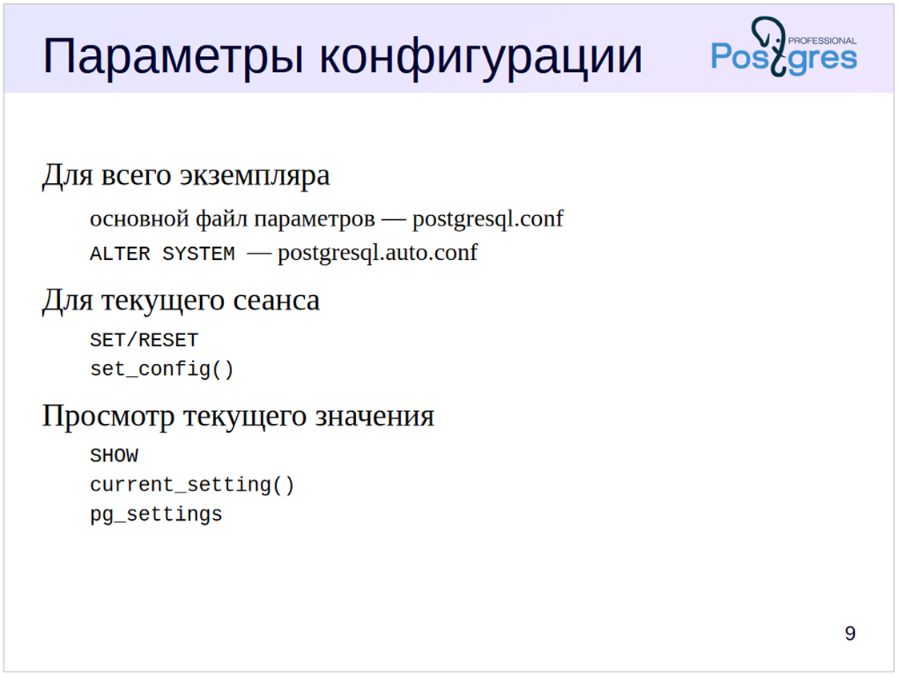

# Параметры конфигурации PostgreSQL

Сервер PostgreSQL настраивается с помощью разнообразных параметров конфигурации, которые позволяют управлять ресурсами, настраивать служебные процессы и пользовательские сеансы, управлять журналом сервера и решать многие другие задачи. Поэтому нужно знать, как проверить текущие значения параметров и установить новые.

Настройки всего сервера обычно задаются в конфигурационных файлах. Основной конфигурационный файл — `postgresql.conf`, он редактируется вручную. Второй конфигурационный файл — `postgresql.auto.conf` — предназначен для изменения специальной командой `ALTER SYSTEM`. Параметры, установленные через `ALTER SYSTEM`, имеют приоритет над параметрами в `postgresql.conf`.

Директивы включения файлов и каталогов `include` и `include_dir` позволяют разделять сложные файлы `postgresql.conf` на части. Это может быть удобно, например, при управлении несколькими серверами с похожими конфигурациями.

Большинство параметров конфигурации допускает изменение значений в пользовательских сеансах прямо во время выполнения. Помимо системных, можно определять и пользовательские параметры и работать с ними с помощью этих же команд и функций.

Варианты установки и управления параметрами:  
https://postgrespro.ru/docs/postgresql/16/config-setting

Текущие значения параметров доступны в представлении `pg_settings`:  
https://postgrespro.ru/docs/postgresql/16/view-pg-settings

## Параметры конфигурации

Основной файл конфигурации `postgresql.conf` расположен в этом каталоге:

```bash
student$ ls -l /etc/postgresql/16/main
total 60
drwxr-xr-x 2 postgres postgres  4096 июл  3  2024 conf.d
-rw-r--r-- 1 postgres postgres   315 июл  3  2024 environment
-rw-r--r-- 1 postgres postgres   143 июл  3  2024 pg_ctl.conf
-rw-r----- 1 postgres postgres  5743 июл  3  2024 pg_hba.conf
-rw-r----- 1 postgres postgres  2640 июл  3  2024 pg_ident.conf
-rw-r--r-- 1 postgres postgres 29960 июл  3  2024 postgresql.conf
-rw-r--r-- 1 postgres postgres   317 июл  3  2024 start.conf
```

Здесь же находятся и другие конфигурационные файлы.

Проверим значение параметра `work_mem`:

```sql
=> SHOW work_mem;
 work_mem 
----------
 4MB
(1 row)
```

Параметр `work_mem` задает объем памяти, который будет использоваться для внутренних операций сортировки и размещения хеш-таблиц, прежде чем будут задействованы временные файлы на диске.

4MB — это значение по умолчанию и оно слишком мало. Допустим, мы хотим увеличить его до 16MB для всего экземпляра. Для этого есть различные пути.

Во-первых, можно внести изменение в `postgresql.conf`, раскомментировав и изменив строку, где определяется параметр:

```bash
student$ grep '#work_mem' /etc/postgresql/16/main/postgresql.conf
#work_mem = 4MB				# min 64kB
```

Во-вторых, можно поместить определение параметра в файл с суффиксом `.conf` в каталоге `/etc/postgresql/16/main/conf.d` или в пользовательский файл конфигурации, местоположение которого следует задать в директиве `include` основного конфигурационного файла `postgresql.conf`.

В-третьих, можно изменить значение параметра с помощью команды SQL — что мы и сделаем:

```sql
=> ALTER SYSTEM SET work_mem TO '16MB';
ALTER SYSTEM
```

Такое изменение попадает не в `postgresql.conf`, а в файл `postgresql.auto.conf`, который находится в каталоге PGDATA:

```bash
student$ sudo cat /var/lib/postgresql/16/main/postgresql.auto.conf
# Do not edit this file manually!
# It will be overwritten by the ALTER SYSTEM command.
work_mem = '16MB'
```

Чтобы изменение вступило в силу, нужно перечитать конфигурационные файлы. Для этого можно воспользоваться `pg_ctlcluster`, либо использовать функцию SQL:

```sql
=> SELECT pg_reload_conf();
 pg_reload_conf 
----------------
 t
(1 row)
```

Убедимся, что новое значение параметра применилось. Кроме команды `SHOW`, можно сделать это таким образом:

```sql
=> SELECT current_setting('work_mem');
 current_setting 
-----------------
 16MB
(1 row)
```

Чтобы восстановить значение параметра по умолчанию, достаточно вместо `SET` использовать команду `RESET` (и, конечно, перечитать конфигурационные файлы):

```sql
=> ALTER SYSTEM RESET work_mem;
ALTER SYSTEM
=> SELECT pg_reload_conf();
 pg_reload_conf 
----------------
 t
(1 row)
```

Большинству параметров можно установить новое значение для текущего сеанса прямо во время его выполнения. Например, если мы собираемся выполнить запрос, сортирующий большой объем данных, то для сеанса можно увеличить значение `work_mem`:

```sql
=> SET work_mem = '64MB';
SET
```

Новое значение действует только в текущем сеансе или даже в текущей транзакции (при указании `SET LOCAL`).

Еще один способ проверить текущее значение — выполнить запрос к представлению:

```sql
=> SELECT name, setting, unit FROM pg_settings WHERE name = 'work_mem';
   name   | setting | unit 
----------+---------+------
 work_mem | 65536   | kB
(1 row)
```

Можно увидеть значение параметра и с помощью команды `\dconfig`:

```sql
=> \dconfig work_mem
List of configuration parameters
 Parameter | Value 
-----------+-------
 work_mem  | 64MB
(1 row)
```

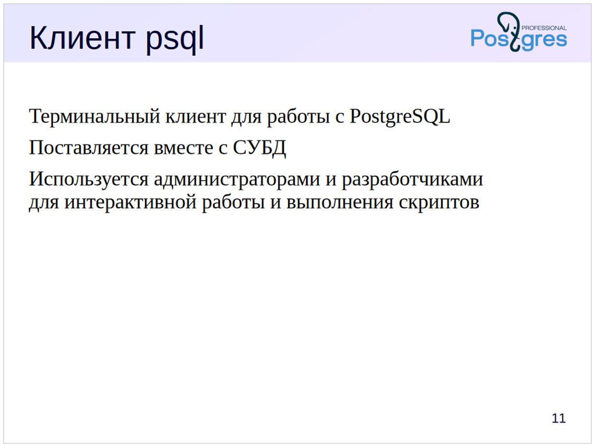


# Работа с клиентом psql

Для работы с СУБД PostgreSQL существуют различные сторонние инструменты, рассмотрение которых не входит в рамки курса.

В курсе мы будем использовать терминальный клиент psql:

1. psql — это единственный клиент, поставляемый вместе с СУБД.
2. Навыки работы c psql пригодятся разработчикам и администраторам вне зависимости от того, с каким инструментом они будут работать.

Для интерактивной работы в psql встроена поддержка readline, программ постраничного просмотра результатов запросов (таких, как less и pspg), а также подключения внешних редакторов. Возможности psql позволяют взаимодействовать с ОС, просматривать содержимое системного каталога, создавать скрипты для автоматизации повторяющихся задач.

https://postgrespro.ru/docs/postgresql/16/app-psql

## Подключение

При запуске psql нужно указать параметры подключения. К обязательным параметрам относятся:

- имя базы данных, по умолчанию совпадает с именем пользователя;
- имя пользователя (роль), по умолчанию совпадает с именем пользователя ОС;
- узел (host), по умолчанию — локальное соединение;
- порт, по умолчанию — обычно 5432.

Параметры указываются так:

```bash
student$ psql -d база -U роль -h узел -p порт
```

Настройки, сделанные в виртуальной машине курса, позволяют подключаться к PostgreSQL без указания параметров:

```bash
student$ psql 
```

Проверим текущее подключение:

```sql
=> \conninfo
You are connected to database "student" as user "student" via socket in 
"/var/run/postgresql" at port "5432".
```

Команда `\connect` выполняет новое подключение, не покидая psql. Ее можно сократить до `\c`. Мы будем указывать необязательную часть имени команды в квадратных скобках: `\c[onnect]`.

## Справочная информация

Справку по psql можно получить не только в документации, но и прямо в системе. Команда

```bash
student$ psql --help
```

выдает справку по запуску. А если PostgreSQL устанавливался с документацией, то справочное руководство можно получить командой

```bash
student$ man psql
```

Утилита psql умеет выполнять команды SQL и свои собственные команды, которые начинаются с обратной косой черты, как `\conninfo`. Команды psql всегда однострочные — в отличие от команд SQL.

Внутри psql есть возможность получить список и краткое описание его собственных команд:

- `\?` выдает список команд psql,
- `\h[elp]` выдает список команд SQL, которые поддерживает сервер, а также синтаксис конкретной команды SQL.

## Форматирование вывода

Клиент psql умеет выводить результаты запросов в разных форматах:

- формат с выравниванием значений;
- формат без выравнивания;
- расширенный формат.

Формат с выравниванием используется по умолчанию:

```sql
=> SELECT name, setting, unit FROM pg_settings LIMIT 7;
            name            |  setting   | unit 
----------------------------+------------+------
 allow_in_place_tablespaces | off        | 
 allow_system_table_mods    | off        | 
 application_name           | psql       | 
 archive_cleanup_command    |            | 
 archive_command            | (disabled) | 
 archive_library            |            | 
 archive_mode               | off        | 
(7 rows)
```

Ширина столбцов выровнена по значениям. Также выводится строка заголовков и итоговая строка.

Команды psql для переключения режима выравнивания:

- `\a` — переключатель режима: с выравниванием/без выравнивания.
- `\t` — переключатель отображения строки заголовка и итоговой строки.

Отключим выравнивание, заголовок и итоговую строку:

```sql
=> \a \t
Output format is unaligned.
Tuples only is on.
=> SELECT name, setting, unit FROM pg_settings LIMIT 7;
allow_in_place_tablespaces|off|
allow_system_table_mods|off|
application_name|psql|
archive_cleanup_command||
archive_command|(disabled)|
archive_library||
archive_mode|off|
=> \a \t
Output format is aligned.
Tuples only is off.
```

Такой формат неудобен для просмотра, но может оказаться полезным для автоматической обработки результатов.

Расширенный формат удобен, когда нужно вывести много столбцов для одной или нескольких записей. Для этого вместо точки с запятой указываем в конце команды `\gx`:

```sql
=> SELECT name, setting, unit, category, context, vartype,
    min_val, max_val, boot_val, reset_val
    FROM pg_settings
    WHERE name = 'work_mem' \gx
-[ RECORD 1 ]----------------------
name      | work_mem
setting   | 4096
unit      | kB
category  | Resource Usage / Memory
context   | user
vartype   | integer
min_val   | 64
max_val   | 2147483647
boot_val  | 4096
reset_val | 4096
```

Если расширенный формат нужен не для одной команды, а постоянно, можно включить его переключателем `\x`. Все возможности форматирования результатов запросов доступны через команду `\pset`.


# Кластер баз данных PostgreSQL

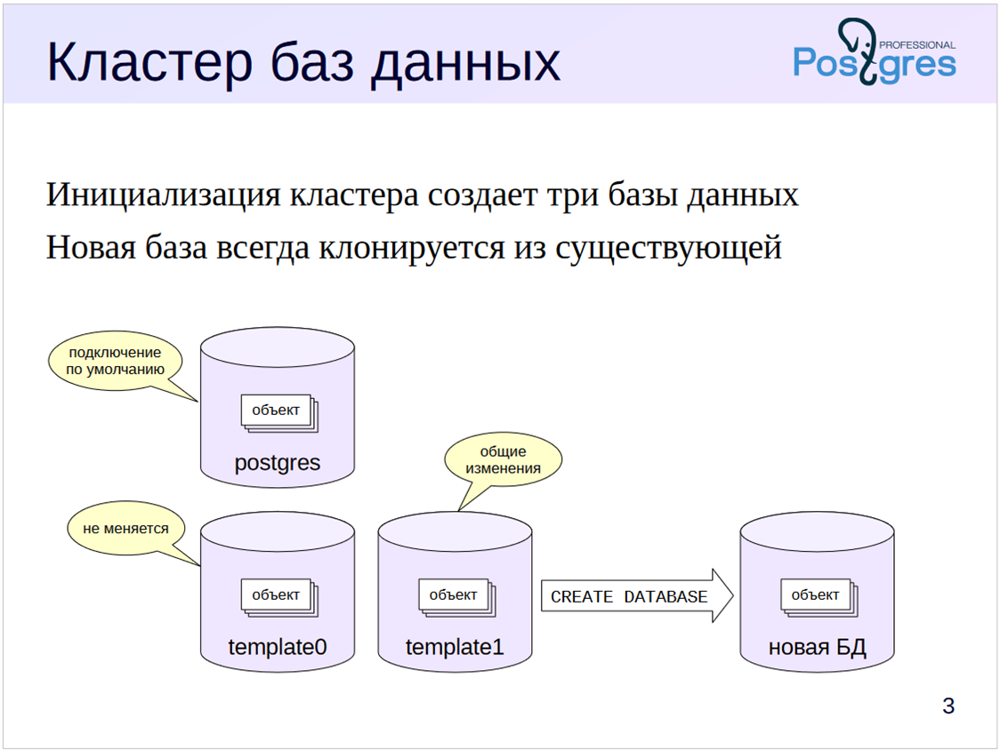

Экземпляр PostgreSQL управляет несколькими базами данных — кластером. При инициализации кластера (автоматически при установке PostgreSQL либо вручную командой `initdb`) создаются три одинаковые базы данных. Все остальные БД, создаваемые пользователем, клонируются из какой-либо существующей.

**Шаблонная БД `template1`** используется по умолчанию для создания новых баз данных. В нее можно добавить объекты и расширения, которые будут копироваться в каждую новую базу данных.

**Шаблон `template0`** не должен изменяться. Он нужен как минимум в двух ситуациях. Во-первых, для восстановления БД из резервной копии, выполненной утилитой `pg_dump` (это рассматривается в теме «Резервное копирование. Логическое резервирование»). Во-вторых, при создании новой БД с кодировкой, отличной от указанной при инициализации кластера (подробнее обсуждается в курсе DBA2).

**База данных `postgres`** используется при подключении по умолчанию пользователем `postgres`. Она не является обязательной, но некоторые утилиты предполагают ее наличие, поэтому ее не рекомендуется удалять, даже если она не нужна.

## Базы данных

Список баз данных можно получить в psql такой командой:

```sql
=> \l
```

База данных `student` была создана для удобства подключения одноименного пользователя. В выводе команды присутствует ряд столбцов, которые нас сейчас не интересуют.

Когда мы создаем новую базу данных, она (по умолчанию) копируется из шаблона `template1`.

```sql
=> CREATE DATABASE data_logical;
CREATE DATABASE
=> \c data_logical
You are now connected to database "data_logical" as user "student".
=> \l
```

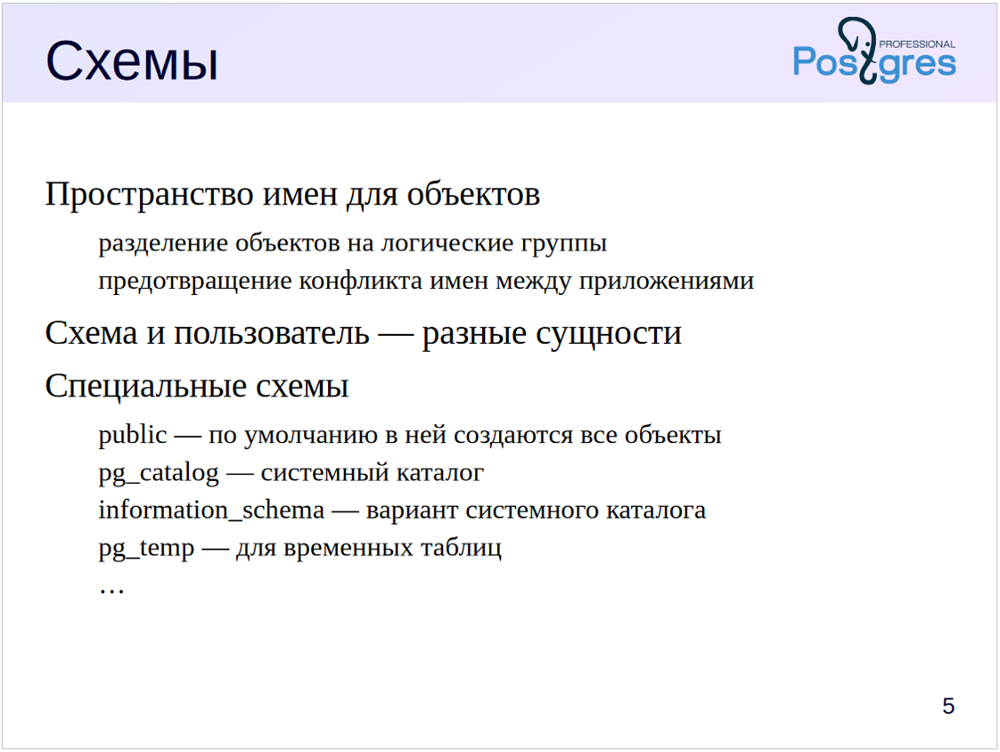


# Схемы в PostgreSQL

Схемы представляют собой пространства имен для объектов БД. Они позволяют:

- Разделить объекты на логические группы для управления ими
- Предотвратить конфликты имен при работе нескольких пользователей
- Изолировать объекты при установке приложений и расширений

В PostgreSQL схема и пользователь — разные сущности (хотя настройки по умолчанию позволяют пользователям удобно работать с одноименными схемами).

## Специальные схемы

Существует несколько специальных схем, обычно присутствующих в каждой базе данных:

### Схема `public`
- Используется по умолчанию для хранения объектов, если не выполнены иные настройки

### Схема `pg_catalog`
- Хранит объекты системного каталога
- Системный каталог — это метаинформация об объектах, принадлежащих кластеру, которая хранится в самом кластере в виде таблиц

### Схема `information_schema`
- Альтернативное представление системного каталога (определенное в стандарте SQL)

### Схема `pg_temp`
- Служит для хранения временных таблиц
- На самом деле таблицы создаются в схемах `pg_temp_1`, `pg_temp_2` и т. п. — у каждого пользователя своя схема
- Но обращаются все пользователи к ней как к `pg_temp`

Есть и другие схемы, но они носят технический характер.


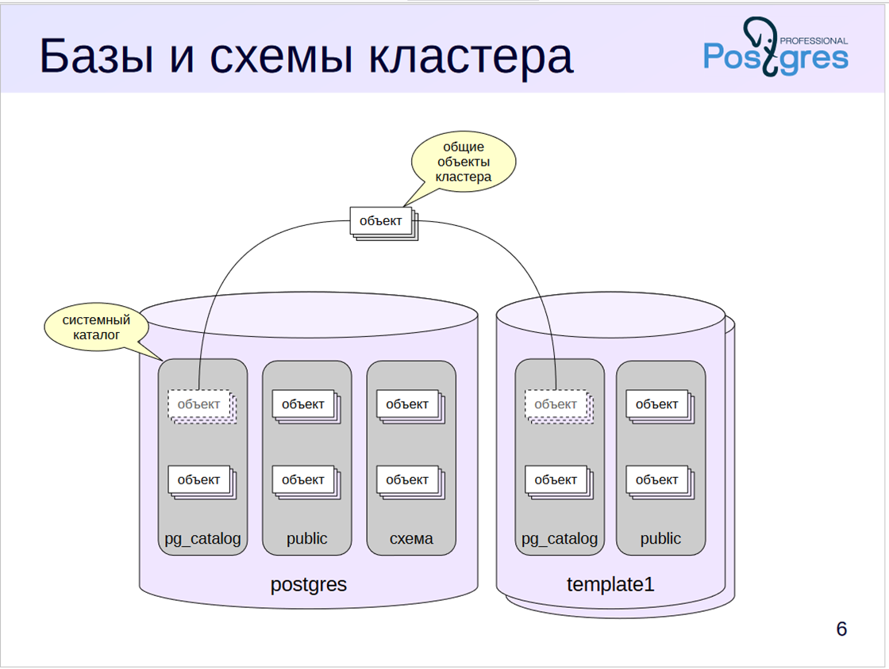


```markdown
# Схемы и системный каталог PostgreSQL

Схемы принадлежат базам данных, все объекты БД распределены по каким-либо схемам.

Однако несколько таблиц системного каталога хранят информацию, общую для всего кластера. Это список баз данных, список пользователей и некоторые другие сведения. Эти таблицы хранятся вне какой-либо конкретной базы данных, но при этом одинаково видны из каждой БД.

Таким образом, клиент, подключенный к какой-либо базе данных, видит в системном каталоге описание объектов не только данной базы, но и общих объектов кластера. Описание объектов других баз данных можно получить, только подключившись к ним.

## Работа со схемами в psql

Для вывода списка схем в psql есть специальная команда (`\dn` = describe namespace):

```sql
=> \dn
```

Эта команда не показывает служебные схемы. Чтобы увидеть их, нужно добавить модификатор `S` (он работает аналогичным образом и для многих других команд):

```sql
=> \dnS
```

Про некоторые из этих схем (`public`, `pg_catalog`, `information_schema`) мы уже говорили; про остальные поговорим позже в других темах.

Еще один полезный модификатор — знак «плюс», который выводит дополнительную информацию:

```sql
=> \dn+
```

## Создание и управление схемами

Создадим новую схему:

```sql
=> CREATE SCHEMA special;
CREATE SCHEMA
=> \dn
       List of schemas
  Name   |       Owner       
---------+-------------------
 public  | pg_database_owner
 special | student
(2 rows)
```

Создадим таблицу:

```sql
=> CREATE TABLE t(n integer);
CREATE TABLE
```

По умолчанию таблица будет создана в схеме `public`. Список таблиц в этой схеме можно получить командой `\dt` с указанием шаблона для имен схем и таблиц:

```sql
=> \dt public.*
        List of relations
 Schema | Name | Type  |  Owner  
--------+------+-------+---------
 public | t    | table | student
(1 row)
```

## Перемещение объектов между схемами

Таблицу (как и другие объекты) можно перемещать между схемами. Поскольку речь идет о логической организации, перемещение происходит только в системном каталоге; сами данные физически остаются на месте.

```sql
=> ALTER TABLE t SET SCHEMA special;
ALTER TABLE
```

Что останется в схеме `public`?

```sql
=> \dt public.*
Did not find any relation named "public.*".
```

Ничего. А в `special`?

```sql
=> \dt special.*
        List of relations
 Schema  | Name | Type  |  Owner  
---------+------+-------+---------
 special | t    | table | student
(1 row)
```

Таблица переместилась. Теперь к ней можно обращаться с явным указанием схемы:

```sql
=> SELECT * FROM special.t;
 n 
---
(0 rows)
```

Но если опустить имя схемы, таблица не будет найдена:

```sql
=> SELECT * FROM t;
ERROR:  relation "t" does not exist
LINE 1: SELECT * FROM t;
                      ^
```

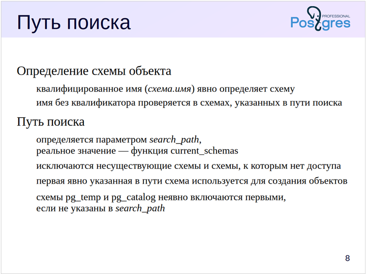

```markdown
# Путь поиска в PostgreSQL

## Определение схемы объекта

- **Квалифицированное имя** (`схема.имя`) — явно определяет схему
- **Имя без квалификатора** — проверяется в схемах, указанных в пути поиска

## Путь поиска

- Определяется параметром `search_path`
- Реальное значение — функция `current_schemas`
- Исключаются несуществующие схемы и схемы, к которым нет доступа
- Первая явно указанная в пути схема используется для создания объектов
- Схемы `pg_temp` и `pg_catalog` неявно включаются первыми, если не указаны в `search_path`

При указании объекта надо определить, о какой схеме идет речь, ведь в разных схемах могут храниться объекты с одинаковыми именами.

Если имя объекта квалифицировано именем схемы, то используется явно указанная схема. Если схема не указана явным образом, то она определяется с помощью конфигурационного параметра `search_path`. Этот параметр содержит путь поиска — список схем, который просматривается последовательно слева направо, при этом из него исключаются несуществующие схемы и те, к которым у пользователя нет доступа.

При создании нового объекта с именем без квалификатора для выбора целевой схемы берется первая из оставшихся в списке, а при поиске объекта в начало пути неявно добавляются:
- Схема `pg_catalog`, чтобы всегда иметь доступ к системному каталогу
- Схема `pg_temp`, если пользователь создавал временные объекты

Реальный путь поиска, включающий неявные схемы, возвращает вызов функции: `current_schemas(true)`.

Можно провести аналогию между путем поиска `search_path` и путем `PATH` в операционных системах.

## Практическая работа с путем поиска

Путь поиска по умолчанию имеет такое значение:

```sql
=> SHOW search_path;
   search_path   
-----------------
 "$user", public
(1 row)
```

Конструкция «$user» обозначает схему с тем же именем, что и имя текущего пользователя (в нашем случае — student). Поскольку такой схемы нет, она игнорируется.

Чтобы не думать над тем, какие схемы есть, каких нет, а какие недоступны, можно воспользоваться функцией:

```sql
=> SELECT current_schemas(false);
 current_schemas 
-----------------
 {public}
(1 row)
```

Передаваемый в функцию логический параметр управляет отображением системных схем, неявно включаемых при поиске. Мы можем увидеть, что кроме исключения несуществующей схемы PostgreSQL неявно включил в начало списка схему системного каталога:

```sql
=> SELECT current_schemas(true);
   current_schemas   
---------------------
 {pg_catalog,public}
(1 row)
```

Установим путь поиска, например, так:

```sql
=> SET search_path = public, special;
SET
```

Теперь таблица будет найдена:

```sql
=> SELECT * FROM t;
 n 
---
(0 rows)
```

Здесь мы установили конфигурационный параметр на уровне сеанса и при переподключении его значение пропадет. Устанавливать такое значение на уровне всего кластера тоже неправильно — возможно, этот путь нужен не всегда и не всем, к тому же в разных БД может быть разный набор схем.

Но параметр можно установить и на уровне отдельной базы данных:

```sql
=> ALTER DATABASE data_logical SET search_path = public, special;
ALTER DATABASE
```

Теперь он будет устанавливаться для всех новых подключений к БД data_logical. Проверим:

```sql
=> \c data_logical
You are now connected to database "data_logical" as user "student".
=> SHOW search_path;
   search_path   
-----------------
 public, special
(1 row)
```
```markdown
# Системный каталог PostgreSQL

Для того, чтобы вывести информацию о любых объектах, psql (как и другие интерактивные пользовательские средства) обращается к таблицам системного каталога.

Например, команда `\l` для получения списка баз данных кластера, обращается к таблице:

```sql
=> SELECT datname FROM pg_database;
```

Мы всегда можем посмотреть, какие запросы выполняет команда:

```sql
=> \set ECHO_HIDDEN on
=> \l
```

Таким образом можно исследовать системный каталог.

Отключим вывод команд:

```sql
=> \set ECHO_HIDDEN off
```

## Структура системного каталога

Список схем находится в таблице:

```sql
=> SELECT nspname FROM pg_namespace;
```

А на такие объекты, как таблицы и индексы, можно посмотреть так:

```sql
=> SELECT relname, relkind, relnamespace FROM pg_class WHERE relname = 't';
```

Все столбцы здесь начинаются на `rel` (relation, отношение).

- `relkind` — тип объекта (r — таблица, i — индекс и т. п.);
- `relnamespace` — схема.

Поле `relnamespace` имеет тип `oid`; вот соответствующая строка таблицы `pg_namespace`:

```sql
=> SELECT oid, nspname FROM pg_namespace WHERE oid = 16387;
```

А вот как можно получить список объектов в схеме, например, `pg_catalog`:

```sql
=> SELECT relname, relkind FROM pg_class
WHERE relnamespace = 'pg_catalog'::regnamespace LIMIT 5;
```

Аналогичные `reg`-типы определены и для некоторых других таблиц системного каталога. Они позволяют упростить запросы и обойтись без явного соединения таблиц.

## Удаление объектов

Можно ли удалить схему `special`?

```sql
=> DROP SCHEMA special;
```

Схему нельзя удалить, если в ней находятся какие-либо объекты. Сначала надо удалить или перенести их.

Но можно удалить схему сразу вместе со всеми ее объектами:

```sql
=> DROP SCHEMA special CASCADE;
NOTICE:  drop cascades to table t
DROP SCHEMA
```

А что с удалением базы данных целиком? Во-первых, нельзя удалить базу, к которой вы подключены в данный момент, поэтому отключимся от нее.

```sql
=> \conninfo
You are connected to database "data_logical" as user "student" via socket in 
"/var/run/postgresql" at port "5432".
=> \c postgres
You are now connected to database "postgres" as user "student".
```

Во-вторых, базу данных также нельзя удалить, если к ней есть активные подключения. Создадим такое подключение в отдельном сеансе и попробуем удалить ее:

```sql
=> \c data_logical
You are now connected to database "data_logical" as user "student".
=> DROP DATABASE data_logical;
ERROR:  database "data_logical" is being accessed by other users
DETAIL:  There is 1 other session using the database.
```

Получили ошибку. Однако можно вызвать команду удаления с параметром `FORCE`, тогда она будет пытаться принудительно завершить все подключения к БД, а затем удалит ее:

```sql
=> DROP DATABASE data_logical WITH (FORCE);
DROP DATABASE
```


## Что такое база данных?

**База данных (БД)** - организованная совокупность данных, хранящихся в соответствии с определенной схемой и управляемых СУБД.


**СУБД (Система управления базами данных)** - программное обеспечение для создания, управления и использования баз данных.

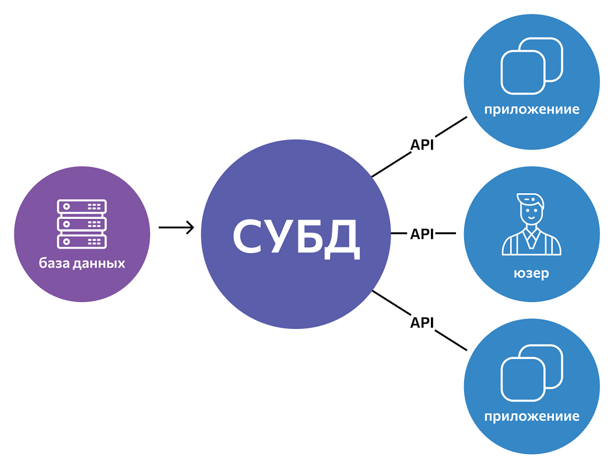

## Реляционная модель данных

### Основные понятия:

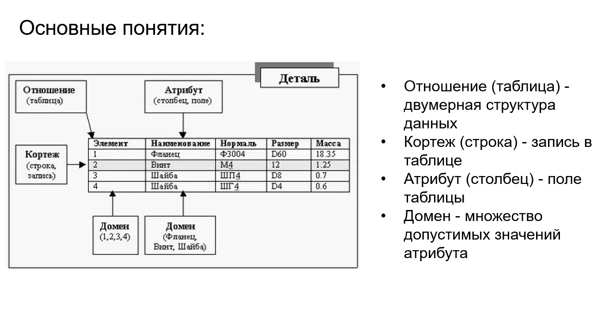

- **Отношение (таблица)** - двумерная структура данных
- **Кортеж (строка)** - запись в таблице
- **Атрибут (столбец)** - поле таблицы
- **Домен** - множество допустимых значений атрибута

### Свойства отношений:

1. Каждая строка уникальна
2. Порядок строк не важен
3. Порядок столбцов не важен
4. Каждое поле содержит только одно значение

## Ключи

### Первичный ключ (Primary Key)

- Уникально идентифицирует каждую строку
- Не может быть NULL
- Не может изменяться

### Внешний ключ (Foreign Key)

- Ссылается на первичный ключ другой таблицы
- Обеспечивает целостность данных

## Нормализация данных

### Первая нормальная форма (1НФ)

- Каждое поле содержит только атомарные значения
- Нет повторяющихся групп

### Вторая нормальная форма (2НФ)

- Соответствует 1НФ
- Каждый неключевой атрибут полностью зависит от первичного ключа

### Третья нормальная форма (3НФ)

- Соответствует 2НФ
- Нет транзитивных зависимостей

## Практические примеры

### Плохой дизайн (не нормализованная таблица):

```
Студенты
+----+----------+----------+----------+----------+
| ID | Имя      | Курс1    | Оценка1  | Курс2    | Оценка2  |
+----+----------+----------+----------+----------+----------+
| 1  | Иванов   | Математика| 5       | Физика   | 4        |
| 2  | Петров   | Математика| 4       | NULL     | NULL     |
+----+----------+----------+----------+----------+----------+
```

### Хороший дизайн (нормализованные таблицы):

```
Студенты
+----+----------+
| ID | Имя      |
+----+----------+
| 1  | Иванов   |
| 2  | Петров   |
+----+----------+

Курсы
+----+----------+
| ID | Название |
+----+----------+
| 1  | Математика|
| 2  | Физика   |
+----+----------+

Оценки
+----+------------+--------+--------+
| ID | Студент_ID | Курс_ID| Оценка |
+----+------------+--------+--------+
| 1  | 1          | 1      | 5      |
| 2  | 1          | 2      | 4      |
| 3  | 2          | 1      | 4      |
+----+------------+--------+--------+
```

## Упражнения

1. Определите, какие проблемы есть в следующей таблице:

```
Заказы
+----+----------+------------+----------+----------+
| ID | Клиент   | Товары     | Цены     | Адрес    |
+----+----------+------------+----------+----------+
| 1  | Иванов   | Хлеб,Молоко| 30,50    |ул.Мира,1 |
+----+----------+------------+----------+----------+
```

2. Приведите таблицу к 3НФ.
