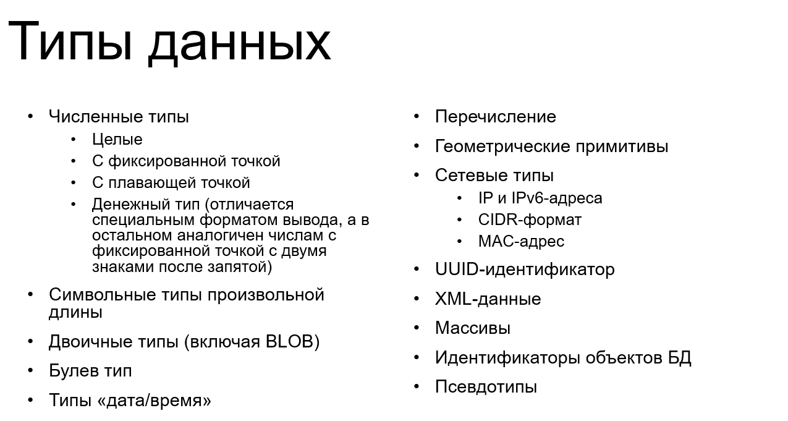

# Тема 1. Введение. Основы теории баз данных

## Что такое база данных?

**База данных (БД)** - организованная совокупность данных, хранящихся в соответствии с определенной схемой и управляемых СУБД.

**СУБД (Система управления базами данных)** - программное обеспечение для создания, управления и использования баз данных.

## Реляционная модель данных

### Основные понятия:

- **Отношение (таблица)** - двумерная структура данных
- **Кортеж (строка)** - запись в таблице
- **Атрибут (столбец)** - поле таблицы
- **Домен** - множество допустимых значений атрибута

### Свойства отношений:

1. Каждая строка уникальна
2. Порядок строк не важен
3. Порядок столбцов не важен
4. Каждое поле содержит только одно значение

## Ключи

### Первичный ключ (Primary Key)

- Уникально идентифицирует каждую строку
- Не может быть NULL
- Не может изменяться

### Внешний ключ (Foreign Key)

- Ссылается на первичный ключ другой таблицы
- Обеспечивает целостность данных

## Нормализация данных

### Первая нормальная форма (1НФ)

- Каждое поле содержит только атомарные значения
- Нет повторяющихся групп

### Вторая нормальная форма (2НФ)

- Соответствует 1НФ
- Каждый неключевой атрибут полностью зависит от первичного ключа

### Третья нормальная форма (3НФ)

- Соответствует 2НФ
- Нет транзитивных зависимостей

