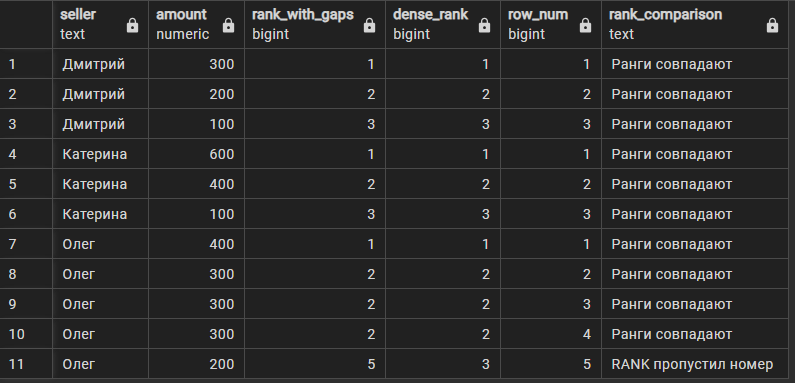
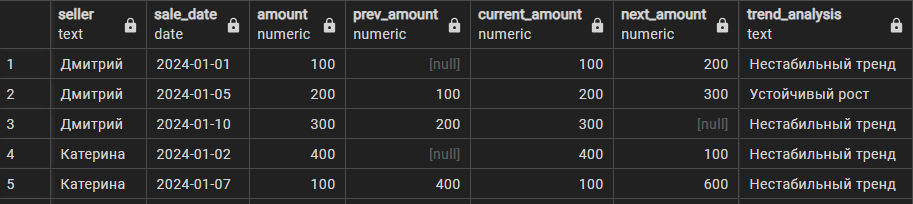

# Оконные функции PostgreSQL: Полное руководство

## Подготовка данных

Создадим расширенную таблицу продаж для демонстрации:

```sql
CREATE TABLE sales (
    id SERIAL PRIMARY KEY,
    seller TEXT,
    sale_date DATE,
    amount NUMERIC,
    product_category TEXT
);

INSERT INTO sales (seller, sale_date, amount, product_category) VALUES
('Дмитрий', '2024-01-01', 100, 'Электроника'),
('Дмитрий', '2024-01-05', 200, 'Одежда'),
('Дмитрий', '2024-01-10', 300, 'Электроника'),
('Катерина', '2024-01-02', 400, 'Книги'),
('Катерина', '2024-01-07', 100, 'Одежда'),
('Катерина', '2024-01-08', 600, 'Электроника'),
('Олег', '2024-01-03', 300, 'Книги'),
('Олег', '2024-01-10', 300, 'Книги'),
('Олег', '2024-01-12', 300, 'Одежда');
```

---

## LEAD() — Заглядываем в будущее

Функция `LEAD()` позволяет "заглянуть вперед" и получить значение из следующих строк.

### Базовый синтаксис

```sql
LEAD(column, offset, default) OVER (PARTITION BY ... ORDER BY ...)
```

### Пример 1: Следующая продажа

```sql
SELECT
    seller,
    sale_date,
    amount,
    LEAD(amount) OVER (PARTITION BY seller ORDER BY sale_date) AS next_sale,
    LEAD(sale_date) OVER (PARTITION BY seller ORDER BY sale_date) AS next_date
FROM sales
ORDER BY seller, sale_date;

-- add window
SELECT
    seller,
    sale_date,
    amount,
    LEAD(amount) OVER w AS next_sale,
    LEAD(sale_date) OVER w AS next_date
FROM sales
WINDOW w AS (PARTITION BY seller ORDER BY sale_date)
ORDER BY seller, sale_date;
```

### Пример 2: Прогноз тренда

```sql
SELECT
    seller,
    sale_date,
    amount,
    LEAD(amount) OVER (PARTITION BY seller ORDER BY sale_date) AS next_amount,
    CASE 
        WHEN LEAD(amount) OVER (PARTITION BY seller ORDER BY sale_date) > amount 
        THEN 'Рост ожидается'
        WHEN LEAD(amount) OVER (PARTITION BY seller ORDER BY sale_date) < amount 
        THEN 'Снижение ожидается'
        WHEN LEAD(amount) OVER (PARTITION BY seller ORDER BY sale_date) = amount 
        THEN 'Стабильность'
        ELSE 'Последняя продажа'
    END AS trend_forecast
FROM sales
ORDER BY seller, sale_date;


-- with window

SELECT
    seller,
    sale_date,
    amount,
    LEAD(amount) OVER w AS next_amount,
    CASE 
        WHEN LEAD(amount) OVER w > amount 
        THEN 'Рост ожидается'
        WHEN LEAD(amount) OVER w < amount 
        THEN 'Снижение ожидается'
        WHEN LEAD(amount) OVER w = amount 
        THEN 'Стабильность'
        ELSE 'Последняя продажа'
    END AS trend_forecast
FROM sales
WINDOW w AS (PARTITION BY seller ORDER BY sale_date)
ORDER BY seller, sale_date;

--with refact

```

### Пример 3: Смещение на 2 позиции вперед

```sql
SELECT
    seller,
    sale_date,
    amount,
    LEAD(amount, 2, 0) OVER (PARTITION BY seller ORDER BY sale_date) AS amount_in_2_deals
FROM sales;
```

---

## FIRST_VALUE() — Точка отсчета

Функция возвращает первое значение в окне, что полезно для сравнения с базовой линией.

### Пример 1: Рост относительно первой продажи

```sql
SELECT
    seller,
    sale_date,
    amount,
    FIRST_VALUE(amount) OVER (PARTITION BY seller ORDER BY sale_date) AS baseline,
    amount - FIRST_VALUE(amount) OVER (PARTITION BY seller ORDER BY sale_date) AS growth,
    ROUND(
        (amount::NUMERIC / FIRST_VALUE(amount) OVER (PARTITION BY seller ORDER BY sale_date) - 1) * 100, 
        2
    ) AS growth_percent
FROM sales
ORDER BY seller, sale_date;

--with windows

```

### Пример 2: Первая продажа по категории

```sql
SELECT
    seller,
    product_category,
    sale_date,
    amount,
    FIRST_VALUE(amount) OVER (
        PARTITION BY seller, product_category 
        ORDER BY sale_date
    ) AS first_in_category
FROM sales
ORDER BY seller, product_category, sale_date;
```

---

# LAST_VALUE() — Финальная точка

⚠️ **Ловушка новичка:** По умолчанию окно идет от начала до текущей строки!

## Что происходит по умолчанию

PostgreSQL использует **неявные границы окна**:
- `RANGE BETWEEN UNBOUNDED PRECEDING AND CURRENT ROW`
- Это означает: от первой строки группы до текущей строки

## Демонстрация проблемы

**Данные:**
```
Дмитрий: 100 (01.01) → 200 (05.01) → 300 (10.01)
```

**Неправильно (возвращает текущее значение):**
```sql
SELECT
    seller,
    sale_date,
    amount,
    LAST_VALUE(amount) OVER (PARTITION BY seller ORDER BY sale_date) AS wrong_last
FROM sales;
```

**Результат:**
```
seller   | sale_date  | amount | wrong_last
---------|------------|--------|------------
Дмитрий  | 2024-01-01 | 100    | 100        ← окно: [100]
Дмитрий  | 2024-01-05 | 200    | 200        ← окно: [100, 200]  
Дмитрий  | 2024-01-10 | 300    | 300        ← окно: [100, 200, 300]
```

## Правильное решение

**Указываем границы окна явно:**
```sql
SELECT
    seller,
    sale_date,
    amount,
    LAST_VALUE(amount) OVER (
        PARTITION BY seller ORDER BY sale_date
        ROWS BETWEEN UNBOUNDED PRECEDING AND UNBOUNDED FOLLOWING
    ) AS correct_last
FROM sales;
```

**Результат:**
```
seller   | sale_date  | amount | correct_last
---------|------------|--------|-------------
Дмитрий  | 2024-01-01 | 100    | 300         ← окно: [100, 200, 300]
Дмитрий  | 2024-01-05 | 200    | 300         ← окно: [100, 200, 300]
Дмитрий  | 2024-01-10 | 300    | 300         ← окно: [100, 200, 300]
```

## Объяснение границ окна

- **`UNBOUNDED PRECEDING`** — от самой первой строки группы
- **`UNBOUNDED FOLLOWING`** — до самой последней строки группы
- **`CURRENT ROW`** — текущая строка (по умолчанию)

## Альтернативные варианты границ

```sql
-- Последние 3 строки
ROWS BETWEEN 2 PRECEDING AND CURRENT ROW

-- Текущая и следующие 2 строки  
ROWS BETWEEN CURRENT ROW AND 2 FOLLOWING

-- Все строки в группе
ROWS BETWEEN UNBOUNDED PRECEDING AND UNBOUNDED FOLLOWING
```

## Практический пример с проверкой

```sql
SELECT
    seller,
    sale_date,
    amount,
    LAST_VALUE(amount) OVER w AS final_amount,
    CASE 
        WHEN amount = LAST_VALUE(amount) OVER w 
        THEN 'Финальная сделка'
        ELSE 'Промежуточная'
    END AS deal_status
FROM sales
WINDOW w AS (
    PARTITION BY seller ORDER BY sale_date
    ROWS BETWEEN UNBOUNDED PRECEDING AND UNBOUNDED FOLLOWING
)
ORDER BY seller, sale_date;
```

## Ключевое правило

**Всегда явно указывайте границы окна для `LAST_VALUE()`**, иначе получите текущее значение вместо последнего!


### Пример: Сравнение с финальным результатом

```sql
SELECT
    seller,
    sale_date,
    amount,
    LAST_VALUE(amount) OVER (
        PARTITION BY seller ORDER BY sale_date
        ROWS BETWEEN UNBOUNDED PRECEDING AND UNBOUNDED FOLLOWING
    ) AS final_amount,
    LAST_VALUE(amount) OVER (
        PARTITION BY seller ORDER BY sale_date
        ROWS BETWEEN UNBOUNDED PRECEDING AND UNBOUNDED FOLLOWING
    ) - amount AS distance_to_final
FROM sales
ORDER BY seller, sale_date;
```

---

## ROW_NUMBER() — Уникальная нумерация

Присваивает уникальный номер каждой строке, даже при одинаковых значениях.

### Пример 1: Хронология сделок

```sql
SELECT
    seller,
    sale_date,
    amount,
    ROW_NUMBER() OVER (PARTITION BY seller ORDER BY sale_date) AS deal_sequence,
    ROW_NUMBER() OVER (ORDER BY sale_date) AS global_sequence
FROM sales
ORDER BY sale_date;
```

### Пример 2: Топ-N запросы

```sql
-- Первые 2 сделки каждого продавца
SELECT seller, sale_date, amount
FROM (
    SELECT *,
           ROW_NUMBER() OVER (PARTITION BY seller ORDER BY sale_date) AS rn
    FROM sales
) ranked
WHERE rn <= 2;
```

### Пример 3: Удаление дубликатов

```sql
-- Если бы были дубликаты, оставили бы только первый
DELETE FROM sales 
WHERE id IN (
    SELECT id FROM (
        SELECT id,
               ROW_NUMBER() OVER (
                   PARTITION BY seller, sale_date, amount 
                   ORDER BY id
               ) AS rn
        FROM sales
    ) t WHERE rn > 1
);
```

---

## RANK() — Олимпийская система

При одинаковых значениях присваивает одинаковый ранг, но следующий ранг пропускается.

### Пример 1: Рейтинг продаж

```sql
SELECT
    seller,
    amount,
    sale_date,
    RANK() OVER (PARTITION BY seller ORDER BY amount DESC) AS sales_rank,
    CASE RANK() OVER (PARTITION BY seller ORDER BY amount DESC)
        WHEN 1 THEN '🥇 Лучшая'
        WHEN 2 THEN '🥈 Вторая'
        WHEN 3 THEN '🥉 Третья'
        ELSE '📊 Остальные'
    END AS medal
FROM sales
ORDER BY seller, amount DESC;
```

### Пример 2: Процентили

```sql
SELECT
    seller,
    amount,
    RANK() OVER (ORDER BY amount DESC) AS global_rank,
    ROUND(
        (RANK() OVER (ORDER BY amount DESC) - 1) * 100.0 / 
        (COUNT(*) OVER () - 1), 
        1
    ) AS percentile
FROM sales
ORDER BY amount DESC;
```

## Интерпретация

* 0% процентиль = лучший результат (никто не лучше)
* 12.5% процентиль = 87.5% результатов хуже
* 75% процентиль = только 25% результатов лучше

## Процентили помогают понять относительную позицию в общем распределении значений.
---

## DENSE_RANK() — Справедливое ранжирование

Как RANK(), но без пропусков в нумерации.

### Пример: Сравнение RANK() и DENSE_RANK()

```sql

INSERT INTO sales (seller, sale_date, amount) VALUES
('Олег', '2024-02-12', 400),
('Олег', '2024-02-08', 200);


SELECT
    seller,
    amount,
    RANK() OVER (PARTITION BY seller ORDER BY amount DESC) AS rank_with_gaps,
    DENSE_RANK() OVER (PARTITION BY seller ORDER BY amount DESC) AS dense_rank,
    ROW_NUMBER() OVER (PARTITION BY seller ORDER BY amount DESC) AS row_num,
    -- Демонстрация разницы
    CASE 
        WHEN RANK() OVER (PARTITION BY seller ORDER BY amount DESC) = 
             DENSE_RANK() OVER (PARTITION BY seller ORDER BY amount DESC)
        THEN 'Ранги совпадают'
        ELSE 'RANK пропустил номер'
    END AS rank_comparison
FROM sales
ORDER BY seller, amount DESC;
```




---

## Продвинутые техники

### 1. Комбинирование функций

```sql
SELECT
    seller,
    sale_date,
    amount,
    -- Предыдущая, текущая, следующая
    LAG(amount) OVER w AS prev_amount,
    amount AS current_amount,
    LEAD(amount) OVER w AS next_amount,
    -- Тренд из трех точек
    CASE 
        WHEN LAG(amount) OVER w < amount AND amount < LEAD(amount) OVER w 
        THEN 'Устойчивый рост'
        WHEN LAG(amount) OVER w > amount AND amount > LEAD(amount) OVER w 
        THEN 'Устойчивое снижение'
        ELSE 'Нестабильный тренд'
    END AS trend_analysis
FROM sales
WINDOW w AS (PARTITION BY seller ORDER BY sale_date);
```



### 2. Скользящие вычисления

```sql
SELECT
    seller,
    sale_date,
    amount,
    -- Скользящая сумма (текущая + предыдущая)
    amount + COALESCE(LAG(amount) OVER w, 0) AS rolling_sum_2,
    -- Средняя из трех последних
    ROUND(
        (amount + 
         COALESCE(LAG(amount, 1) OVER w, amount) +
         COALESCE(LAG(amount, 2) OVER w, amount)
        ) / 3.0, 
        2
    ) AS moving_avg_3
FROM sales
WINDOW w AS (PARTITION BY seller ORDER BY sale_date)
ORDER BY seller, sale_date;

```

### 3. Поиск экстремумов

```sql
SELECT
    seller,
    sale_date,
    amount,
    CASE 
        WHEN amount = MAX(amount) OVER w THEN 'Максимум'
        WHEN amount = MIN(amount) OVER w THEN 'Минимум'
        ELSE 'Обычная'
    END AS extremum_type,
    -- Отклонение от среднего
    ROUND(amount - AVG(amount) OVER w, 2) AS deviation_from_avg
FROM sales
WINDOW w AS (PARTITION BY seller)
ORDER BY seller, sale_date;

```

---

## Практические кейсы

### Кейс 1: Анализ сезонности

```sql
SELECT
    EXTRACT(MONTH FROM sale_date) AS month,
    seller,
    amount,
    AVG(amount) OVER (
        PARTITION BY EXTRACT(MONTH FROM sale_date)
    ) AS month_avg,
    amount - AVG(amount) OVER (
        PARTITION BY EXTRACT(MONTH FROM sale_date)
    ) AS seasonal_deviation
FROM sales
ORDER BY month, seller;
```

### Кейс 2: Выявление аномалий

```sql
WITH stats AS (
    SELECT
        seller,
        sale_date,
        amount,
        AVG(amount) OVER (PARTITION BY seller) AS avg_amount,
        STDDEV(amount) OVER (PARTITION BY seller) AS stddev_amount
    FROM sales
)
SELECT
    seller,
    sale_date,
    amount,
    CASE 
        WHEN ABS(amount - avg_amount) > 2 * stddev_amount 
        THEN 'Аномалия'
        ELSE 'Норма'
    END AS anomaly_status
FROM stats
ORDER BY seller, sale_date;
```

### Кейс 3: Когортный анализ

```sql
SELECT
    seller,
    sale_date,
    amount,
    FIRST_VALUE(sale_date) OVER w AS cohort_start,
    sale_date - FIRST_VALUE(sale_date) OVER w AS days_since_start,
    ROW_NUMBER() OVER w AS transaction_number
FROM sales
WINDOW w AS (PARTITION BY seller ORDER BY sale_date)
ORDER BY seller, sale_date;
```
## Когортный анализ — отслеживание поведения групп

Когорта — группа пользователей с общей характеристикой (например, дата первой покупки).

Что показывает запрос
Для каждого продавца отслеживаем:

Когда он начал работать

Сколько дней прошло с начала

Какая это по счету транзакция


---

## Оптимизация производительности

### 1. Использование WINDOW для повторяющихся окон

```sql
-- Неэффективно (повторяем определение окна)
SELECT
    seller,
    amount,
    ROW_NUMBER() OVER (PARTITION BY seller ORDER BY sale_date),
    RANK() OVER (PARTITION BY seller ORDER BY sale_date),
    DENSE_RANK() OVER (PARTITION BY seller ORDER BY sale_date)
FROM sales;

-- Эффективно (определяем окно один раз)
SELECT
    seller,
    amount,
    ROW_NUMBER() OVER w,
    RANK() OVER w,
    DENSE_RANK() OVER w
FROM sales
WINDOW w AS (PARTITION BY seller ORDER BY sale_date);
```

### 2. Индексы для оконных функций

```sql
-- Создаем индекс для ускорения PARTITION BY и ORDER BY
CREATE INDEX idx_sales_seller_date ON sales (seller, sale_date);
CREATE INDEX idx_sales_seller_amount ON sales (seller, amount DESC);
```

---

## Заключение

Оконные функции PostgreSQL — мощный инструмент для аналитики:

- **LAG()/LEAD()** — анализ трендов и прогнозирование
- **FIRST_VALUE()/LAST_VALUE()** — сравнение с базовыми точками
- **ROW_NUMBER()** — уникальная нумерация и топ-N запросы
- **RANK()/DENSE_RANK()** — ранжирование и процентили

Ключевые принципы:

1. Всегда используйте ORDER BY
2. Правильно определяйте границы окна для LAST_VALUE()
3. Используйте WINDOW для оптимизации
4. Создавайте подходящие индексы
5. Комбинируйте функции для сложной аналитики
